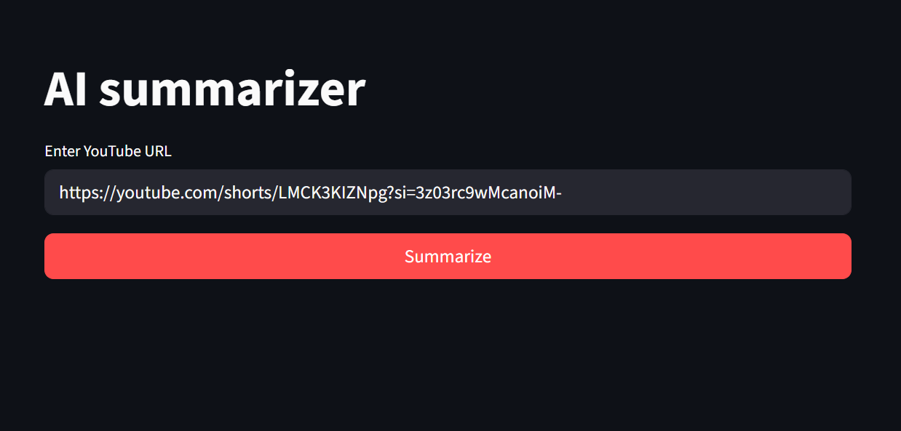
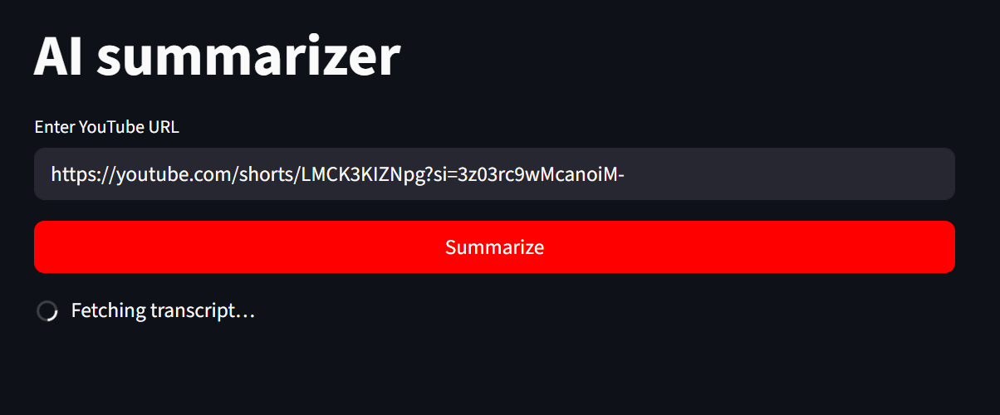
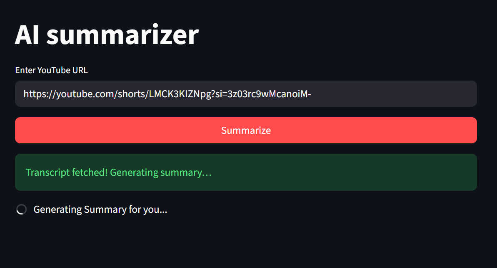
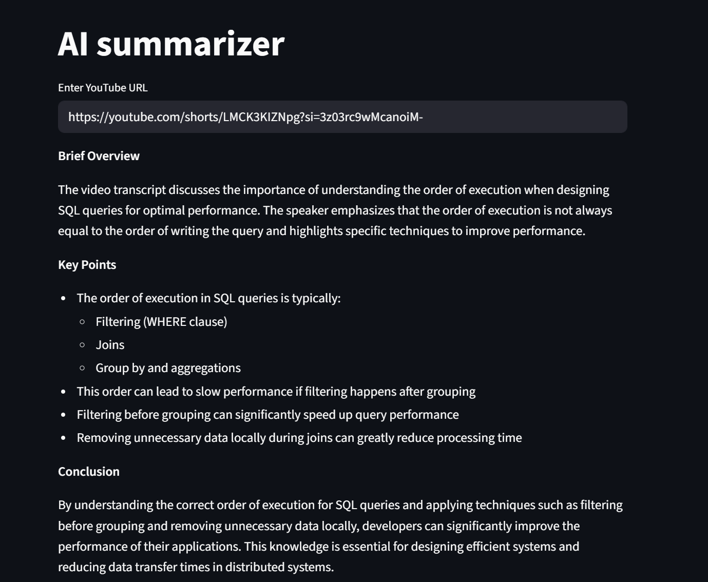

# AI-Summarizer
Helps in making study notes by summarizing long lecture youtube videos...

# Screen shots
- **step 1**: Pass the youtube URL as input via text field, And click on the "summarize" button

---
- **step 2**: In the backend the video will be converted into audio and then it is converted into transcription.

---
- **step 3**: After the transcription is generated, This generated text will be passed to LLM, And it will generate the summary.

---
- **step 4**: Finally, The summary will be generated and displayed.


---

### **Project Overview**
A Streamlit web application that automatically extracts, transcribes, and summarizes YouTube lecture videos using local AI models. Perfect for converting long educational content into concise study notes.

---

### **Implementation Status Breakdown**

| Component | Status | Details |
|-----------|--------|---------|
| **Core Functionality** | ✅ 100% | YouTube extraction → Transcription → Summarization pipeline fully operational |
| **Streamlit UI** | ✅ 95% | Interactive interface with input fields, buttons, and output display |
| **Audio Extraction (yt-dlp)** | ✅ 100% | Downloads best audio from YouTube videos using temp directories |
| **Transcription (Whisper)** | ✅ 100% | Converts audio to text using OpenAI Whisper base model |
| **AI Summarization (Ollama)** | ✅ 100% | Local LLM (llama3.2:3b) generates structured summaries |

---

### **Real-Time Usefulness**

**Why This is Valuable:**

1. **Time Efficiency** ⏱️
   - Converts 1-hour lecture (60 min) → 2-3 minute summary
   - Students get instant study notes without manual note-taking

2. **Accessibility** 🎯
   - Works offline (uses local Ollama, no cloud API costs)
   - Runs on any machine with Python + Ollama installed
   - No subscription fees for AI processing

3. **Learning Enhancement** 📚
   - Structured output (overview → key points → conclusion)
   - Captures main concepts while filtering noise
   - Enables quick revision for exams

4. **Scalability** 📈
   - Process entire lecture playlists in batch mode
   - Build comprehensive note databases from video libraries
   - Works with any YouTube video (tutorials, courses, podcasts)

5. **Cost Savings** 💰
   - Free vs. ChatGPT Plus ($20/month) or paid transcription services
   - Local processing = no API call limits

---

### **Tech Stack**
- **Frontend**: Streamlit (web UI)
- **Audio Download**: yt-dlp
- **Transcription**: OpenAI Whisper
- **AI Model**: Ollama + Llama 3.2 (local)
- **Language**: Python 3.11+

---

### **Quick Usage Flow**
```
User enters YouTube URL 
    ↓
yt-dlp extracts audio 
    ↓
Whisper transcribes audio to text 
    ↓
Ollama summarizes transcript 
    ↓
Display formatted summary in Streamlit
